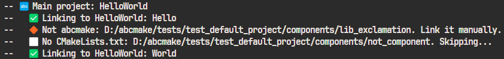
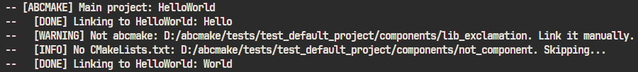

# abcmake - Simple CMake for Simple Projects


[](https://github.com/an-dr/abcmake/actions/workflows/test.yml)

`abcmake` or **Andrei's Build CMake subsystem** is a CMake module providing a set of functions focused on working with a project as a set of components - individually buildable units.

The module is designed to simplify the process of creating and linking components in a project. The module works best with small and medium-sized projects.

[](release/ab.cmake)

The default project structure is shown below but can be customized up to your needs. Components can be interdependent and can be linked to each other. The module will take care of the linking process.

```
Default project structure
-------------------------

+📁Root Project
|
|--+📁components    <------- nested abcmake projects
|  |
|  |--+📁component1
|  |  |---📁include    <---- public headers
|  |  |---📁components
|  |  |---📁src    <-------- src and private headers
|  |  |---ab.cmake
|  |  '--CMakeLists.txt
|  |
|  |--+📁component2
|  ...
|
|---📁include
|---📁src
|---ab.cmake
'--CMakeLists.txt
```

## Table of Contents


- [abcmake - Simple CMake for Simple Projects](#abcmake---simple-cmake-for-simple-projects)
    - [Table of Contents](#table-of-contents)
    - [Quick Start](#quick-start)
    - [Public Functions](#public-functions)
        - [add\_main\_component](#add_main_component)
        - [add\_component](#add_component)
        - [register\_components](#register_components)
        - [target\_link\_components](#target_link_components)
    - [Configuration](#configuration)
        - [ABCMAKE\_EMOJI](#abcmake_emoji)

## Quick Start

1. Create a folder i.e. `PROJECT_NAME`
2. Move all headers and sources to `PROJECT_NAME/include` and `PROJECT_NAME/src` folders respectively. All headers from `include` will be accessible to the parent project.
3. Download an [`ab.cmake`](release/ab.cmake) file to the `PROJECT_NAME` folder
4. Update your cmake file to look like this:

```cmake
cmake_minimum_required(VERSION 3.5) # abcmake requirement
project(HelloWorld)

include(ab.cmake)
add_main_component(${PROJECT_NAME})

```

If you want to use the module in your project, you can use the badge:

[](https://github.com/an-dr/abcmake)

```markdown
[](https://github.com/an-dr/abcmake)
```

## Public Functions

*The module provides several powerful functions, fully compatible with the standard CMake.*

### add_main_component

```cmake
add_main_component(<name> [INCLUDE_DIR] <includes> ... [SOURCE_DIR] <sources> ...)
```

Add an executable target. It links all components in the **components** folder automatically. If the component is not an abcmake component, the directory will be added but the linking has to be done manually using [`target_link_libraries`](https://cmake.org/cmake/help/latest/command/target_link_libraries.html#target-link-libraries).

The default include and source directories are **include** and **src** respectively. You can override them with your custom list of directories.

```cmake
# Will look for `include` and `src` directories in the root folder, 
# and will link all components in the `components` folder
add_main_component(HelloWorld)

# Custom include and source directories
add_main_component(HelloWorld INCLUDE_DIR "private_include" "public_include" 
                              SOURCE_DIR "src1" "src2")
```

### add_component

```cmake
add_component(<name> [SHARED] [INCLUDE_DIR] <includes> ... [SOURCE_DIR] <sources> ...)
```

Add a library target. If the `SHARED` keyword is present, the library will be shared, overwise it will be static.  Works similarly to `add_main_component`.

### register_components

```cmake
register_components(<path1> <path2> ...)
```

Register components by their paths. This function is used to link components by name. For linking use the names defined by the `project()` function in the component's `CMakeLists.txt`.

NOTE: The order of registration is important, i.e. if component A depends on component B, component B should be registered first.

```cmake
# Registering components
register_components(${CMAKE_CURRENT_LIST_DIR}/libs/hello 
                    ${CMAKE_CURRENT_LIST_DIR}/libs/world)
```

### target_link_components

```cmake
target_link_components (<target> [PATH] <component_paths> ... [NAME] <component_names> ...)
```

Add components to the target. Can be used for linking components from custom directories and linking components between each other. Accepts a list of values. For relative paths, use `${CMAKE_CURRENT_LIST_DIR}`. To be able to link components by name, they must be registered via `register_components` function.

```cmake

# Linking a component in the same folder
target_link_components(${PROJECT_NAME} ${CMAKE_CURRENT_LIST_DIR}/../my_component)

# Linking many components including registered ones
register_components(${CMAKE_CURRENT_LIST_DIR}/common/FirstComponent 
                    ${CMAKE_CURRENT_LIST_DIR}/common/SecondComponent)
                    
target_link_components(${PROJECT_NAME} PATH ${CMAKE_CURRENT_LIST_DIR}/libs/hello 
                                            ${CMAKE_CURRENT_LIST_DIR}/libs/world
                                       NAME FirstComponent 
                                            SecondComponent)
```

## Configuration

The module can be configured by setting environment variables:

### ABCMAKE_EMOJI

If set will use emojis in the output.

`ABCMAKE_EMOJI = 1`:



`ABCMAKE_EMOJI = 0`:


